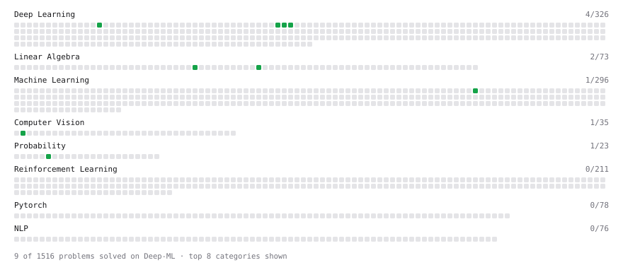

# Deep-ML

My machine learning practice from [Deep-ML](https://www.deep-ml.com). Every solution here was written by hand.

**10** solved · 10 problems · 0 labs · 0 math

[**Browse the interactive portfolio**](https://CharanTeja-06.github.io/deep-ml/) to replay this filling in over time.

## Problems

| | Difficulty | Solved | |
| --- | --- | --- | --- |
| [Adamax Optimizer](https://www.deep-ml.com/problems/148) | easy | 2026-10-06 | [solution](problems/0148-adamax-optimizer) |
| [Calculate Computational Efficiency of MoE](https://www.deep-ml.com/problems/123) | easy | 2026-10-10 | [solution](problems/0123-calculate-computational-efficiency-of-moe) |
| [Calculate Conditional Probability from Data](https://www.deep-ml.com/problems/168) | easy | 2026-10-08 | [solution](problems/0168-calculate-conditional-probability-from-data) |
| [Check Linear Independence of Vectors](https://www.deep-ml.com/problems/331) | easy | 2026-10-04 | [solution](problems/0331-check-linear-independence-of-vectors) |
| [GeLU Activation Function ](https://www.deep-ml.com/problems/147) | easy | 2026-10-04 | [solution](problems/0147-gelu-activation-function) |
| [Grayscale Image Contrast Calculator](https://www.deep-ml.com/problems/82) | easy | 2026-10-09 | [solution](problems/0082-grayscale-image-contrast-calculator) |
| [Implement Polynomial Kernel Function](https://www.deep-ml.com/problems/281) | easy | 2026-10-05 | [solution](problems/0281-implement-polynomial-kernel-function) |
| [KL Divergence Between Two Normal Distributions](https://www.deep-ml.com/problems/56) | easy | 2026-10-02 | [solution](problems/0056-kl-divergence-between-two-normal-distributions) |
| [Momentum Optimizer](https://www.deep-ml.com/problems/146) | easy | 2026-10-03 | [solution](problems/0146-momentum-optimizer) |
| [Phi Transformation for Polynomial Features](https://www.deep-ml.com/problems/84) | easy | 2026-10-07 | [solution](problems/0084-phi-transformation-for-polynomial-features) |

---

_This file is regenerated by Deep-ML on every push._
